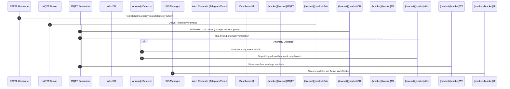

# System Architecture

PowerGuard IoT uses a decoupled, distributed microservices architecture designed to support high-throughput, low-latency, real-time energy telemetry streaming and anomaly detection. 

---

## 1. Network Topology & System Block Diagram

```mermaid
graph TD
    subgraph Edge ["Edge Layer (Hardware)"]
        ESP32["ESP32 Microcontroller"]
        CT["CT Clamp Sensor"]
        PT["Voltage Transformer"]
        OLED["SSD1306 OLED Screen"]
        ESP32 -->|Analog Read| CT
        ESP32 -->|Analog Read| PT
        ESP32 -->|SPI/I2C| OLED
    end

    subgraph Messaging ["Ingress & Messaging"]
        MQTTBroker["Mosquitto MQTT Broker"]
        ESP32 -->|MQTT / TLS (JSON)| MQTTBroker
    end

    subgraph Core ["Core Application (Backend)"]
        MQTTSub["MQTT Subscriber Thread"]
        FastAPI["FastAPI Web Server"]
        WSManager["WebSocket Manager"]
        AnomalyEngine["Hybrid Anomaly Detector"]
        ReportGen["PDF Report Generator"]
        Forecaster["Forecasting Engine"]

        MQTTBroker -->|Subscribe| MQTTSub
        MQTTSub -->|Validate & Stream| AnomalyEngine
        MQTTSub -->|Broadcast| WSManager
        MQTTSub -->|Insert| InfluxDB
        
        FastAPI -->|REST Routes| ReportGen
        FastAPI -->|REST Routes| Forecaster
        FastAPI -->|WebSockets| WSManager
    end

    subgraph Storage ["Database & Analytics"]
        InfluxDB[("InfluxDB Time-Series DB")]
    end

    subgraph Alerts ["Alert Integration"]
        Telegram["Telegram Bot API"]
        Email["SMTP Email Server"]
        AnomalyEngine -->|HTTP POST| Telegram
        AnomalyEngine -->|SMTP| Email
    end

    subgraph UI ["User Interface"]
        Dashboard["React-like HTML/CSS/JS Dashboard"]
        Dashboard -->|REST Requests| FastAPI
        Dashboard -->|WebSockets Live Feed| WSManager
    end
```

---

## 2. Component Breakdown

### A. Edge Layer (Firmware)
- **Role**: Continuous analog monitoring and JSON telemetry dispatch.
- **Components**:
  - **ESP32 DevKitC**: Captures sensor inputs, handles network auto-reconnection, and manages local states.
  - **Sensors**: Non-invasive current clamps (SCT-013-000) and AC-AC step-down voltage transformers (ZMPT101B).
  - **OLED Display**: Local 128x64 SSD1306 display rotating through real-time telemetry channels.

### B. Ingress Layer
- **Role**: Low-overhead message distribution.
- **Mosquitto MQTT Broker**: Standard lightweight broker processing telemetry payloads under strict topic hierarchies.

### C. Backend Application Layer (FastAPI)
- **Role**: Processing logic, storage routing, and client synchronization.
- **MQTT Subscriber**: Async task running in the background lifecycle of FastAPI. Reconnnects automatically and forwards valid JSON messages.
- **Hybrid Anomaly Detector**: Employs rule-based parameters (e.g., peak thresholds, maximum duration limits) and Isolation Forest models to flag anomalies.
- **WebSocket Manager**: Broadcasts active sensor metrics dynamically to all active connections.

### D. Time-Series Storage
- **Role**: High-speed write and analytical queries.
- **InfluxDB**: Configured with a default 30-day retention policy to capture high-resolution timestamped electrical metrics.

---

## 3. Telemetry Pipeline Sequence Flow


